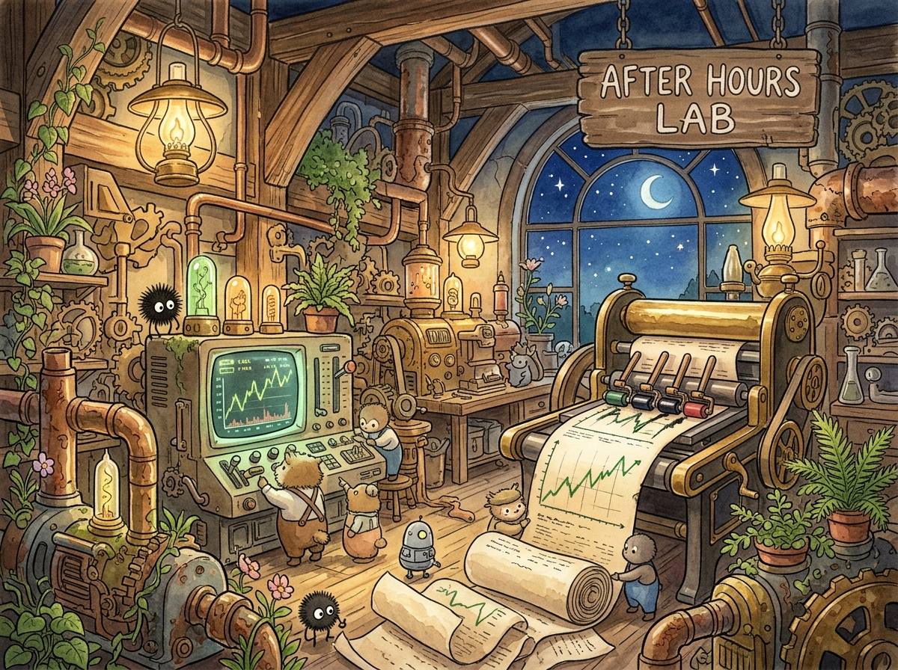

<p align="center">
  
</p>

# AfterHoursLab

A read-only research lab for after-hours earnings reactions.

The auditable chain: raw gateway evidence → authoritative OHLCV coverage →
versioned reaction features → versioned following-session outcomes →
preregistered studies → one sealed out-of-sample result.

## Setup

```bash
uv sync
cp .env.example .env   # fill in SCHWAB_GATEWAY_URL, SCHWAB_GATEWAY_API_KEY, DATABASE__*
uv run afterhours-lab-migrate
```

```bash
uv run pytest
uv run ruff check .
```

## Core workflow

| Step | Command |
| --- | --- |
| Archive after-close earnings into the watchlist | `afterhours-lab-archive-earnings` |
| Capture authoritative OHLCV for a phase | `afterhours-lab-capture-ohlcv --phase earnings_regular --market-date 2026-08-26` |
| Audit captured coverage | `afterhours-lab-audit-ohlcv --date 2026-08-26` |
| Compute a reaction report (read-only) | `afterhours-lab-reactions --from 2026-08-01 --to 2026-08-31` |
| Persist reaction features | `afterhours-lab-persist-reactions --from 2026-08-01 --to 2026-08-31` |
| Persist following-session outcomes | `afterhours-lab-persist-outcomes --from 2026-08-01 --to 2026-08-31` |
| Register / evaluate a study | `afterhours-lab-study register --spec studies/example.json` |
| Live watchlist viewer | `afterhours-lab-watch` |
| Gateway smoke test | `afterhours-lab-smoke` |

Every persistence step is insert-only and versioned — reruns never overwrite prior
evidence or results, and definition changes ship as a new version rather than an edit.

## Database

Postgres/TimescaleDB, migrated with `afterhours-lab-migrate` (forward-only, no
rollback tooling by design). Core tables: `earnings_events`, `candles`,
`quote_evidence` / `bar_evidence`, `earnings_ohlcv_coverage`,
`earnings_reaction_features`, `following_session_outcomes`, `study_*`, and
append-only `research_notes`.

## Research access

`afterhours_lab.research` is the single typed read layer over the database —
CLI, notebooks, and the website all go through it, so a join or definition only
changes once.

```python
from afterhours_lab.research import EventFilter, fetch_cohort
from afterhours_lab.research.notebook import research_pool, show_cohort

pool = await research_pool()
async with pool.acquire() as conn:
    cohort = show_cohort(await fetch_cohort(conn, EventFilter(date_from=..., date_to=...)))
```

```bash
uv sync --extra notebooks && uv run jupyter lab   # notebooks/ — read-only clients, no SQL
uv run afterhours-lab-web                          # http://127.0.0.1:8055 — /today /events /quality
```

## Deployment

Runs on Docker Compose on `monitoring_net`, alongside `schwab-gateway`. Batch jobs
(`archive-earnings`, OHLCV capture, `persist-reactions`, `persist-outcomes`) run from
cron via `infra/cron/`; the research website and raw quote monitor are long-running
services with `restart: unless-stopped`. See `infra/` for cron and logrotate configs.

```bash
docker compose build
docker compose run --rm afterhours-lab afterhours-lab-migrate
docker compose up -d afterhours-lab-web afterhours-lab-monitor
```
